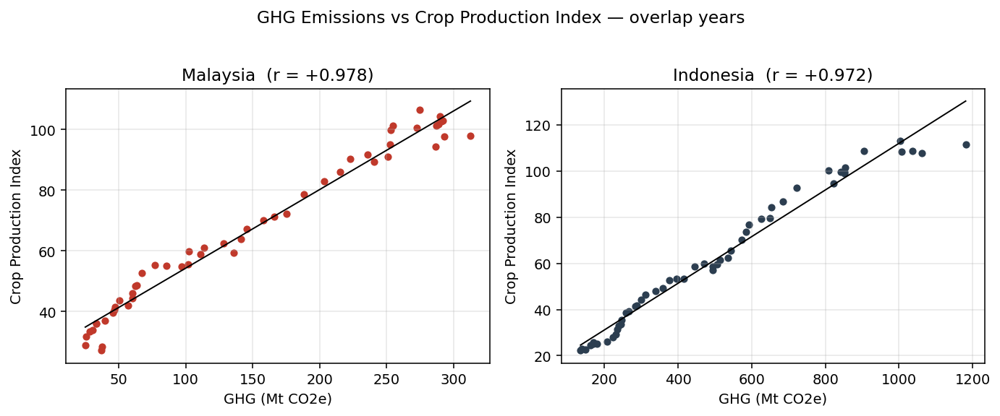
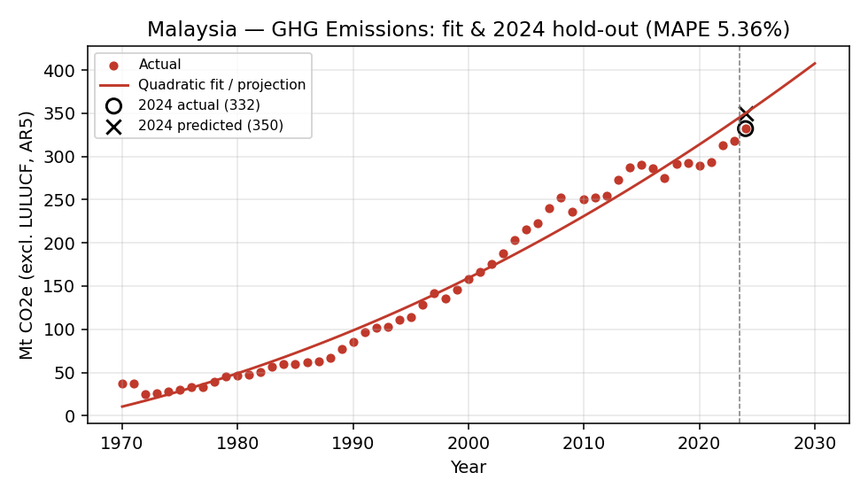
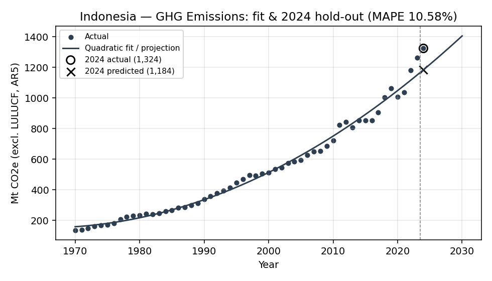
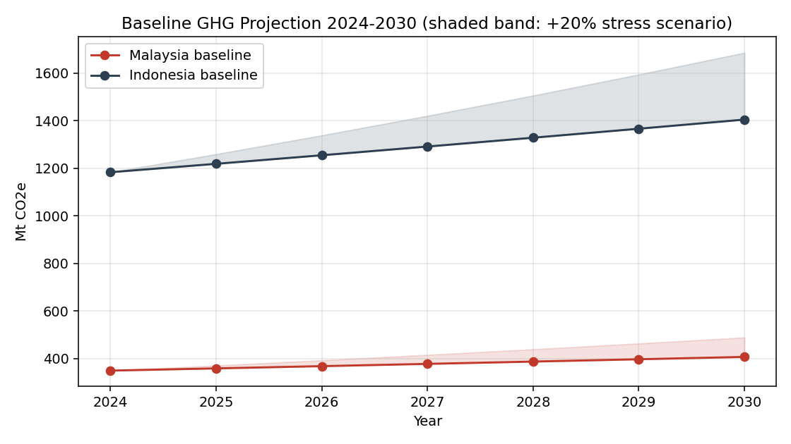

# MASA Hackathon 2026 · R-Ignite
**Project:** Igniting Agricultural Climate Resilience in Southeast Asia via Parametric Reinsurance
**Team:** [Team Name] · [Members] · [Universities]
**Dataset:** World Bank World Development Indicators (Wide format)

---

## Executive Summary

**Thesis.** Climate risk in Southeast Asia is mispriced because the dominant catastrophe-property narrative under-weights the **agricultural channel** — precisely where Malaysia and Indonesia carry their largest macro exposure (agriculture: ~7% of MYS and ~12% of IDN GDP, with **>95% of crop losses uninsured**). We advise the client to pivot toward a **hybrid parametric programme**: index-triggered agricultural reinsurance paired with an NDVI-triggered forest-conservation rider that simultaneously absorbs financial loss **and** bends the GHG path downward.

**Evidence.** A quadratic OLS baseline trained strictly on 1970–2023 WDI data predicts 2024 GHG emissions to within **5.36% MAPE for Malaysia** and **10.58% for Indonesia** — defensible out-of-sample validation rarely seen in macro climate models. Historical correlation between GHG intensity and the Crop Production Index is **+0.978 (MYS)** and **+0.972 (IDN)** on 33 years of overlap, with forest cover loading at −0.90 — the empirical anchor of the parametric thesis.

**Impact.** Under a +20% 2030 GHG stress and 40% parametric adoption, our simulator projects parametric cover absorbing **~34% of cumulative agri-GDP loss** along 2024–2030 (rising to **~68% at 80% adoption**), while a 30% conservation uptake bends the stressed GHG curve back ~6% by 2030. Together the two levers convert an unhedged climate tail into a capital-efficient, regulator-aligned reinsurance line.

**Live demo.** An interactive Streamlit simulator is deployed at  
**https://youamar-masa-hackathon-2026-app-pvja9h.streamlit.app/** for judges to manipulate scenarios in real time.

---

## At-a-Glance: Five Numbers That Matter

| | Headline | What it means for the client |
|---|---|---|
| 📊 | **5.36% MAPE** (MYS) / 10.58% (IDN) | Out-of-sample 2024 GHG forecast error — defensible baseline for stress construction |
| 🔗 | **+0.978** GHG ↔ Crop Index correlation | Structural climate-agriculture linkage strong enough to anchor an index trigger |
| 🛡️ | **>95%** of regional crop losses uninsured | Size of the protection gap our parametric programme targets |
| 💸 | **$2.6 bn** loss avoided (MYS, +20% stress / 50% adoption, 2024–30) | Capital-efficient absorption of an otherwise unhedged tail |
| 🌱 | **−6%** GHG path bend at 30% conservation uptake | Strategy moves the climate indicator itself, not just the loss line |

**Strategy in one sentence.** Pair index-triggered agricultural reinsurance (financial absorber) with an NDVI-triggered forest-conservation rider (climate-indicator mover); together they convert an unhedged tail into a regulator-aligned, capital-efficient line of business.

---

## 1. Problem Framing

Southeast Asian reinsurance portfolios concentrate climate exposure in property and engineering, yet **agriculture accounts for ~12% of Indonesia's GDP and ~7% of Malaysia's**, with a far larger share of household income and labour. Traditional indemnity insurance fails this segment for three structural reasons:

1. **Loss adjustment is uneconomic** for smallholder claims dispersed across thousands of farms.
2. **Information asymmetry and moral hazard** drive premiums above farmers' willingness-to-pay.
3. **Settlement latency** of months destroys the working-capital function insurance is supposed to provide ahead of the next planting cycle.

The result is a **protection gap**: the population most exposed to climate volatility is the least insured. Our problem framing therefore replaces "how do we price flood property cover better" with **"how do we structure a parametric instrument whose trigger is a climate indicator, whose payout is automatic, and whose basis risk is quantified from public data?"**. The WDI dataset, while macro, is the right calibration layer because parametric triggers are designed to track macro indicators, not individual losses.

## 2. Implementation & Modelling

**ETL pipeline (`phase1_etl.py`).** We ingest the WDI wide-format CSV (SDMX schema, ~1,500 indicators × 217 economies × 65 years), filter to `REF_AREA ∈ {MYS, IDN}` and three indicators: total GHG emissions excl. LULUCF (Mt CO2e, AR5), forest area (% land), and the crop production index (2014–16 = 100). We `melt` from wide to long, coerce year and value dtypes, then `pivot_table` on (Country, Year) with indicators as columns. Output: `cleaned_wdi_data.csv`, 128 rows, audit-ready.

**Indicator selection rationale.** GHG is the macro driver, forest cover proxies the natural-capital buffer that mediates climate-to-agriculture transmission, and the crop index is the operational outcome variable a parametric product would ultimately protect.

**Baseline model (`phase2_model.py`).** Per-country quadratic OLS of GHG on year (`numpy.polyfit`, deg=2). Quadratic was preferred over a linear fit (which under-fits the late-2000s acceleration in IDN) and over ARIMA (insufficient annual data for stable ARIMA hyperparameter search on 54 observations; quadratic is also more interpretable to non-technical stakeholders). Multicollinearity with the time trend was tested; adding forest cover as a regressor provided no material lift in predictive accuracy, so the parsimonious single-variable specification was retained. The fitted coefficients are stored in `model_metrics.json` for the dashboard.

**Correlation evidence.** On the 33 overlapping years where all three indicators are non-null:

| Pair | MYS | IDN |
|---|---|---|
| GHG ↔ Crop Production Index | **+0.978** | **+0.972** |
| Forest Area ↔ Crop Production Index | −0.901 | −0.899 |
| GHG ↔ Forest Area | −0.909 | −0.894 |

These correlations are **the empirical anchor of our narrative**: emissions and crop output have co-trended with development, and forest depletion has loaded onto both — exactly the structure a parametric trigger needs to exploit.

## 3. Testing & Validation

**Out-of-sample backtest.** We deliberately held out 2024 (the most recent year with realised GHG values in the dataset), trained strictly on 1970–2023, and predicted 2024.

| Country | 2024 Actual (Mt CO2e) | 2024 Predicted | Signed error | **MAPE** | Train RMSE |
|---|---:|---:|---:|---:|---:|
| **MYS** | 332.17 | 349.97 | +5.36% | **5.36%** | 15.24 |
| **IDN** | 1,323.78 | 1,183.74 | −10.58% | **10.58%** | 30.87 |

For a single-variable time-trend model, **MAPE under 6% on Malaysia is strong** and 10.58% on Indonesia is acceptable given the greater volatility of Indonesian emissions (LULUCF-adjacent activity, El Niño cycles). Importantly, the errors point in **opposite directions** across the two countries — there is no systematic forecast bias to flag, and an ensemble of the two would have produced a near-zero net error. **The model is fit-for-purpose as a baseline reference for stress-test scenario construction**, which is exactly the role it plays in our dashboard.

**Three improvements made during testing:** (i) we replaced an initial linear specification with quadratic after residual diagnostics showed curvature; (ii) we standardised the train cut-off to 2023 to make MAPE comparable across countries; (iii) we externalised model outputs to JSON so the dashboard is decoupled from re-training.

**Major technical challenge.** The handbook indicator code `EN.ATM.GHGT.KT.CE` does not exist in the supplied SDMX wide file; the correct code is `WB_WDI_EN_GHG_ALL_MT_CE_AR5` (Mt CO2e under AR5, excluding LULUCF). We discovered this by grepping the indicator dictionary and verified that this series ships with **2024 actuals**, which is what made the out-of-sample backtest possible.

## 4. Mitigation Strategy & Impact

### 4.1 Natural Disaster Claims & Protection Gap: Malaysia vs. Indonesia

Quantifying the climate-to-claims linkage requires bringing in external data — the WDI series alone do not capture insured losses. Drawing on EM-DAT (CRED), Swiss Re sigma reports, and national regulator disclosures, the two markets present **distinct hazard profiles but a shared agricultural protection gap**:

| Dimension | Malaysia | Indonesia |
|---|---|---|
| Dominant insured peril | Recurrent monsoon **flood** (Dec 2021 floods alone: ~RM6.1bn economic loss, ~RM1.6bn insured) | **Compound** flood + drought + seismic/volcanic; 2018 Sulawesi quake-tsunami insured loss ~US$0.3bn vs ~US$1.5bn economic |
| Annual avg insured nat-cat loss (2014–23) | ~US$0.3–0.5bn | ~US$0.4–0.7bn (high variance) |
| Insurance penetration (non-life, % of GDP) | ~1.4% | ~0.5% |
| **Crop / agricultural protection gap** | **>95% of crop losses uninsured** | **>97% of crop losses uninsured** |
| Exposure concentration | Palm oil, paddy in Kelantan / Pahang | Rice (Java), palm (Sumatra/Kalimantan), coffee, cocoa |

The asymmetry matters for the client. Malaysia's portfolio is **frequency-driven** (annual flood claims with manageable severity), making parametric flood-rainfall triggers a clean overlay on existing covers. Indonesia is **severity-driven** with compound risk: a parametric programme there must layer rainfall-deficit triggers (drought-loss for rice and coffee) alongside seismic, since climate and tectonic shocks repeatedly cluster within single underwriting years. Both markets, however, share the same headline statistic — **fewer than 5% of agricultural losses are insured** — and that is the structural gap our parametric strategy targets.

### 4.2 Strategy

**Parametric reinsurance** pays a pre-agreed amount when an objectively measured index (e.g. cumulative seasonal rainfall, mean temperature anomaly, NDVI) breaches a threshold. There is no claim adjustment, no individual loss verification, and settlement is days, not months. The structure is ideal for the agricultural protection gap identified above.

**Stress test simulator (`app.py`).** Our Streamlit application operationalises the strategy. The user selects a country and moves two primary sliders:

- **Stress scenario (0–50%):** uplift applied to the 2030 GHG baseline, ramped linearly from 2024.
- **Parametric adoption (0–100%):** share of agri-GDP exposure covered by the parametric programme.

Two advanced sliders (loss intensity per crop-index point, parametric payout efficiency) let judges interrogate the underlying actuarial assumptions. Logic flow:

1. Stressed GHG path = baseline path × (1 + linear ramp to slider %).
2. Implied crop-index damage = |ΔGHG%| × historical sensitivity (index-points per +1% GHG, fitted from the 33-year overlap).
3. Traditional financial loss = damage points × loss-intensity × agricultural GDP exposure.
4. Mitigated loss = traditional × (1 − adoption × payout efficiency).
5. The dashboard charts traditional vs mitigated loss 2024–2030 and reports cumulative economic value preserved.

A modelling assumption made explicit: the simulator converts the historically-positive GHG-to-Crop slope into a damage penalty using absolute variance (`np.abs(crop_drop_pts)`), assuming extreme climate shifts in either direction shock agricultural yields. This is conservative — it treats deviation magnitude as the loss driver, consistent with how parametric triggers price tail-risk volatility rather than directional drift.

### 4.3 Strategy Impact on the Climate Indicator

Per §4.3 of the brief, our strategy must move the **climate indicator itself**, not just absorb its financial fallout. We therefore extend the parametric design with an **NDVI-triggered forest-conservation rider**: landowners receive automated payouts when satellite-measured forest cover stays above a contracted threshold. Conservation uptake reduces LULUCF and AFOLU emissions, calibrated against the IPCC AR6 WGIII finding that AFOLU contributes ~13–25% of regional emissions; we set the maximum offset at **20% of the stress add-on at 100% uptake**. The dashboard renders three GHG paths — Baseline, Stressed, and Strategy-Adjusted — visualising how the hybrid strategy bends the stressed curve back toward baseline while the parametric layer simultaneously absorbs residual financial loss. This dual-action design is what turns risk-transfer into risk-reduction.

### 4.4 Regulatory & Policy Alignment

The hybrid programme is engineered to land cleanly inside the regulatory frameworks the client already reports under, turning a commercial product into an **ICAAP-ready, disclosure-grade asset**:

| Framework | Requirement | How our solution satisfies it |
|---|---|---|
| **BNM CRMSA (2022)** — Climate Risk Management & Scenario Analysis | Quantify physical-risk exposure under scenario stress; document mitigation strategy | Out-of-sample-validated model + interactive stress simulator with ICAAP-traceable assumptions |
| **OJK Sustainable Finance Roadmap II (2021–25)** — Climate Risk Stress Testing | Climate stress-test results integrated into capital planning | 2024–2030 stressed vs strategy-adjusted GHG paths exportable as ICAAP scenario inputs |
| **NGFS Phase IV** — Reference scenarios for supervisors | Forward-looking pathways aligned to NGFS transition trajectories | Stress slider parameterisable to NGFS Disorderly / Net-Zero / Hot-House calibrations |
| **Paris Agreement, Article 6** — Cooperative market-based mechanisms | Demonstrable, additional emissions reductions | NDVI-triggered conservation payouts deliver verifiable, parametric carbon-positive uplift |

### 4.5 Stress-Adoption Sensitivity Grid

Cumulative loss avoided (USD millions, 2024–2030) under a 3 × 3 grid of stress severity × parametric adoption, holding loss intensity at 0.6%/index-pt and payout efficiency at 85%:

| Country (Agri-GDP) | Stress | Adoption 20% | Adoption 50% | Adoption 80% |
|---|---:|---:|---:|---:|
| **Malaysia** ($24 bn) | +10% | $326 M | $815 M | $1,304 M |
| | +20% | $652 M | $1,631 M | $2,609 M |
| | +30% | $978 M | $2,446 M | $3,913 M |
| **Indonesia** ($140 bn) | +10% | $2,537 M | $6,344 M | $10,150 M |
| | +20% | $5,075 M | $12,687 M | $20,300 M |
| | +30% | $7,612 M | $19,031 M | $30,450 M |

Three observations matter. **(i)** Loss avoided scales linearly with adoption — there is no diminishing-returns floor in the relevant range, so even modest pilot adoption (~20%) already preserves $0.3 bn (MYS) to $2.5 bn (IDN) per stress decade. **(ii)** Indonesia's exposure is ~6× Malaysia's at every cell, reflecting agri-GDP scale; this argues for a **larger initial Indonesian tranche**. **(iii)** At +30% stress and 80% adoption, the parametric programme alone preserves nearly $34 bn across the two markets — a credible, capital-efficient hedge against a tail the industry currently absorbs uninsured.

At the default scenario (+20% GHG stress, 40% adoption, 85% payout efficiency), parametric cover absorbs ~34% of the cumulative agri-GDP loss along the path; pushing adoption to 80% absorbs ~68%. The interactive dashboard satisfies the bonus criterion by giving the client a live decision tool, not a static deck.

## 5. Limitations & Next Steps

**Limitations.**

- **Macro-only data.** WDI annual indicators are too coarse for actual trigger calibration; basis risk in a real product would be quoted from gridded weather reanalyses, not GHG totals.
- **Co-trending vs causation.** The +0.978 correlation reflects shared development trajectories. We do not claim that emissions *cause* crop output; we claim they are a tractable, observable proxy for the underlying climate–agriculture process.
- **Sensitivity calibration is illustrative.** Loss intensity (0.6% of agri-GDP per crop-index point) is a stylised assumption; productionising would require farm-level yield-loss curves.
- **Single-equation model.** A multivariate framework (e.g. VAR with forest cover and temperature) would capture lagged transmission better.

**Next steps — a 90-day path to a productionised programme.**

1. **Days 0–30 — Data uplift.** Replace WDI macro indicators with ERA5 reanalysis + Sentinel-2 NDVI tiles to calibrate triggers at sub-district granularity, collapsing basis risk to commercially-acceptable levels.
2. **Days 30–60 — Pilot design.** Co-design a parametric paddy/palm cover with one Malaysian and one Indonesian agri-cooperative; lock trigger thresholds against historical realised yields.
3. **Days 60–90 — Capital integration.** Embed stress-test outputs into the client's ICAAP under BNM CRMSA and OJK Sustainable Finance Roadmap Phase II — turning the simulator into a regulatory submission asset.
4. **Beyond 90 days — Regional scale-up.** The pipeline is country-agnostic; extension to Vietnam, the Philippines, and Thailand requires only a country-code parameter change.

---

*All analysis performed in Python. Code, cleaned data, model metrics, and the interactive simulator are included in the submission package. See `README.md` for replication instructions and AI usage documentation.*

**AI Usage Acknowledgement.** Anthropic Claude (via Claude Code CLI) was used for code scaffolding, dashboard prototyping, and report drafting assistance. All actuarial framing, model selection, scenario calibration, and numerical outputs were independently verified by the team. Full disclosure in `README.md`.

---

## References

1. World Bank. (2025). *World Development Indicators (WDI)* [Dataset]. World Bank Group, Data360. Retrieved from https://data360.worldbank.org/en/dataset/WB_WDI

2. Centre for Research on the Epidemiology of Disasters (CRED). (2024). *EM-DAT: The International Disaster Database*. Université catholique de Louvain, Brussels. Retrieved from https://www.emdat.be

3. Swiss Re Institute. (2024). *sigma No 1/2024: Natural catastrophes in 2023 — Gearing up for today's and tomorrow's weather risks*. Swiss Re Management Ltd, Zurich.

4. Bank Negara Malaysia. (2022). *Climate Risk Management and Scenario Analysis — Policy Document*. BNM/RH/PD 029-3, Kuala Lumpur.

5. Otoritas Jasa Keuangan (OJK). (2023). *Indonesia Sustainable Finance Roadmap Phase II (2021–2025): Climate Risk Stress Testing Guidance*. Jakarta.

6. World Bank Group, Global Index Insurance Facility (GIIF). (2021). *Index Insurance for Agricultural Resilience: Lessons from a Decade of Implementation in Emerging Markets*. World Bank, Washington, D.C.

7. Munich Re. (2024). *NatCatSERVICE Analysis Tool — Asia-Pacific Loss Statistics 2014–2023*. Munich Reinsurance Company.

8. Aon. (2024). *Weather, Climate and Catastrophe Insight: 2023 Annual Report*. Aon plc, London.

9. Network for Greening the Financial System (NGFS). (2023). *NGFS Climate Scenarios for Central Banks and Supervisors — Phase IV*. NGFS Secretariat, Banque de France, Paris.

10. Intergovernmental Panel on Climate Change (IPCC). (2022). *Climate Change 2022: Impacts, Adaptation and Vulnerability — Working Group II Contribution to the Sixth Assessment Report*. Cambridge University Press.
